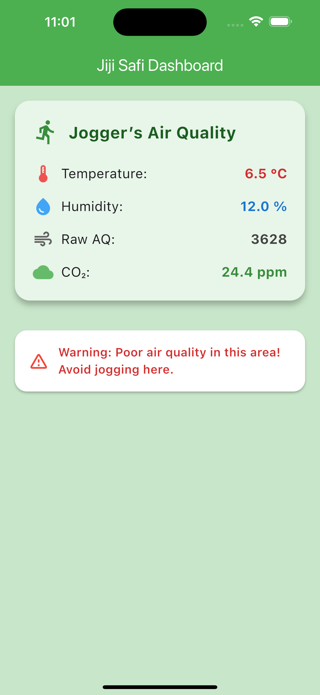
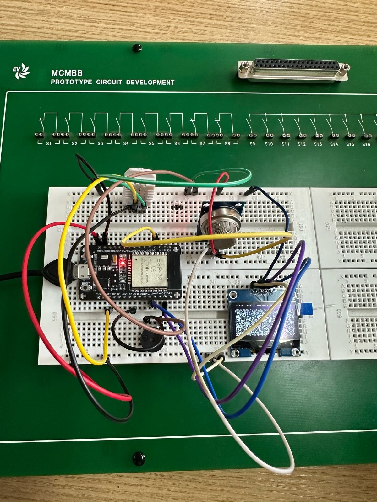
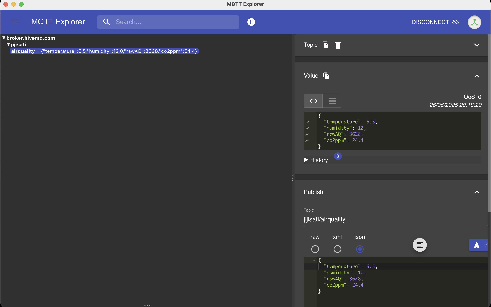

# Jiji Safi - Air Quality Monitoring Dashboard

**Jiji Safi** is a mobile air quality monitoring system that collects environmental data using an ESP32, sensors, and MQTT protocol, and visualizes the data on a Flutter-based dashboard. This solution is designed to help joggers quickly determine whether the air quality is safe for jogging.

---

## Dashboard Overview

The dashboard visualizes four key air quality parameters in real-time:
- **Temperature (°C)**
- **Humidity (%)**
- **Raw Air Quality (sensor output)**
- **CO₂ Concentration (ppm)**

The dashboard also provides a **safety recommendation** based on the CO₂ levels.

| Dashboard Screenshot |
|----------------------|
|  |

When the CO₂ level exceeds a safe threshold, the dashboard displays a **warning message** advising users to avoid jogging in the area.

---

## System Components

### 1. **ESP32 Microcontroller**
The brain of the system, responsible for reading sensor data and publishing it to the MQTT broker.

| Physical Connection |
|---------------------|
|  |

### 2. **Sensors**
- **DHT22:** Measures temperature and humidity.
- **MQ-135 Air Quality Sensor:** Measures CO₂ and general air pollutants.

---

### 3. **MQTT Communication**
The ESP32 publishes the collected data to a free MQTT broker at `broker.hivemq.com`.

| MQTT Client View |
|------------------|
|  |

The published JSON payload:
```json
{
  "temperature": 6.5,
  "humidity": 12.0,
  "rawAQ": 3628,
  "co2ppm": 24.4
}
```
## Circuit Simulation

A **Wokwi simulation** was created to test the setup virtually before implementing it physically.

---

## Workflow

1. **Data Collection:** Sensors connected to the ESP32 collect temperature, humidity, and air quality data.
2. **Data Transmission:** The ESP32 publishes the sensor data to the MQTT broker using Wi-Fi.
3. **Data Visualization:** The Flutter app subscribes to the MQTT topic and updates the dashboard in real-time.
4. **Decision Making:** The dashboard automatically assesses the air quality and provides appropriate jogging recommendations.

---

## Getting Started

> **MQTT is not supported on Flutter Web. Run this project as a mobile app (Android/iOS).**

### To run the project locally:
```bash
flutter pub get
flutter run
